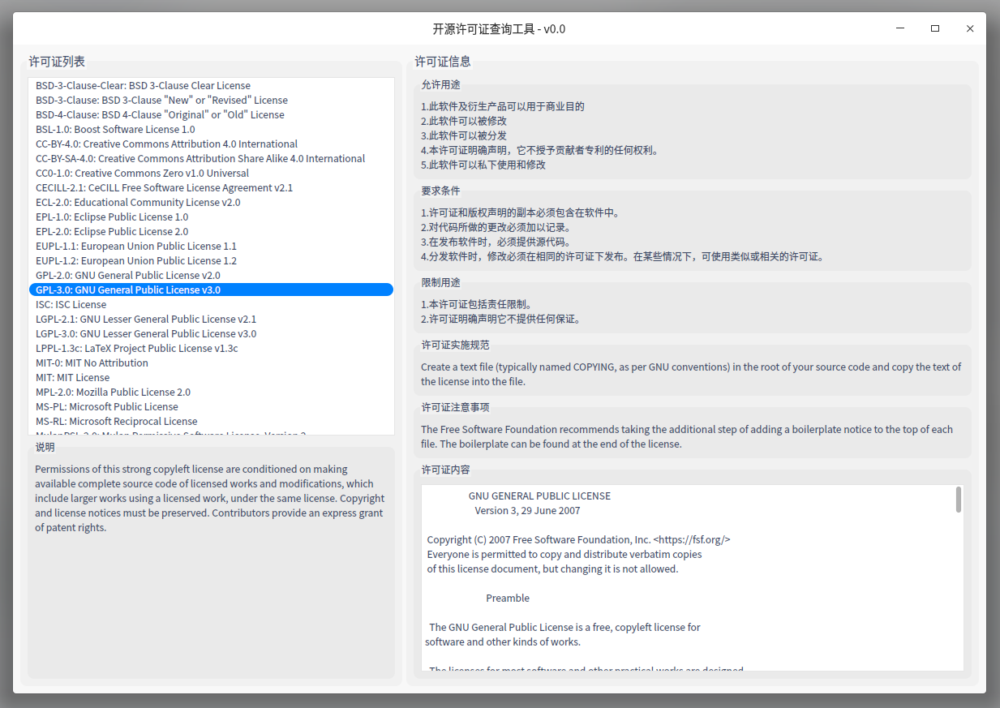

# License 开源许可证搜索工具

## 灵感来源

* [youwant.licenses][youwant-license]: 由 gitee.com 托管的开源许可信息仓库(此软件的信息索引仓库，YouwantWorkSpace插件扩展描述仓库)

* 在线数据仓库:
    * https://choosealicense.com 在线开源许可证查询网站
    * https://spdx.org/licenses/ 由SPDX组织的开源许可证列表
    * https://github.com/github/choosealicense.com 提供有关开源许可的准确信息，遵循SPDX规范并提供可索引的元数据信息以供前端查询

[youwant-license]: https://gitee.com/zinface/youwant.license

### 该工具内部组件分裂

* [NetworkRequest][network-request]: 一个请求组件
* [DebPackageConfig.cmake][cmake-package-deb]: 支持deb打包的cmake模块
* [desktop-template.desktop][desktop-template]: 一个描述 Desktop Entry 的模板
* ...

[network-request]: https://gitee.com/zinface/youwant.qt/tree/master/Components/NetworkRequest
[cmake-package-deb]: https://gitee.com/zinface/youwant.cmake/tree/master/cmake-package-deb-template/cmake
[desktop-template]:https://gitee.com/zinface/youwant.linux/blob/master/freedesktop/desktop-template.desktop